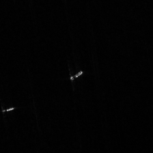
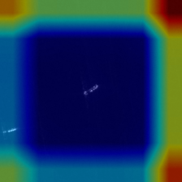
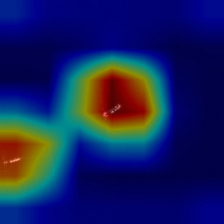
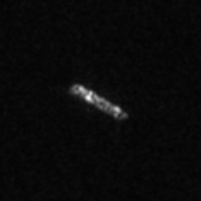
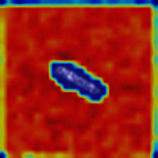
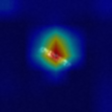
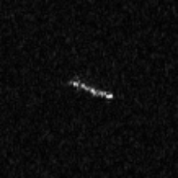
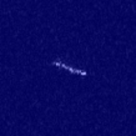
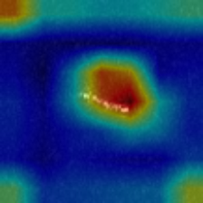

# Deep Learning for SAR Ship classification: Focus on Unbalanced Datasets and Inter-Dataset Generalization

This repository contains the code for training deep learning models for classifying ship types in Synthetic Aperture Radar (SAR) images. The focus is on evaluating performance metrics for unbalanced datasets, where some ship classes may be under-represented compared to others. We use F1-score and Gradcam to understand the class imabalance effect on the performance of deep learning models.

| | | |
|:-------------------------:|:-------------------------:|:-------------------------:|
| Fusar Tanker Image | VGG Gradcam|   Fine tuned VGG Gradcam|
| OpenSarship Cargo |   CNN Gradcam| Fine tuned VGG Gradcam|
| Mixed Fishing |   Resnet Gradcam| Fine tuned VGG Gradcam|

**Models:**

The code implements five different deep learning architectures:

* **CNN**: A custom convolutional neural network (CNN) architecture with batch normalization for improved training stability.
* **VGG**: The VGG16 model, a pre-trained architecture retrained for SAR ship classification.
* **ResNet**: The ResNet50 model, another pre-trained architecture retrained for the task.
* **Fine-Tuned VGG**: Fine tuned VGG16 with its pre-trained layers frozen and a new classifier head added. 
* **Fine-Tuned ResNet**: Fine tuned ResNet50 with its pre-trained layers frozen and a new classifier head added.

**Replication Instructions**

To replicate the experiments and obtain the results, follow these steps:

1. **Download Datasets:**
   - Download the OpenSARShip and Fusar datasets from their respective sources. These datasets are crucial for training and testing the deep learning models.
   - FUSAR: https://drive.google.com/file/d/1SOEMud9oUq69gxbfcBkOvtUkZ3LWEpZJ/view?usp=sharing
   - OpenSARShip: https://emwlab.fudan.edu.cn/67/05/c20899a222981/page.htm

2. **Install Dependencies:**
   - Open a terminal or command prompt and navigate to your project directory.
   - Install the required Python libraries using `pip`:

     ```bash
     pip install -r requirements.txt
     ```

     The `requirements.txt` file specifies all the necessary libraries for running the code.

3. **Prepare Datasets:**
   - Run the `dataset_prep.py` script to process and prepare the downloaded datasets for use with the deep learning models. This script involve tasks like splitting into training and testing sets, creation of merged dataset.

     ```bash
     python dataset_prep.py
     ```

4. **Train and Test Models:**
   - Run the `test_models.py` script to train the deep learning models on the prepared datasets and evaluate their performance on the test sets. This script will perform the training, testing, and save the results and models.

     ```bash
     python test_models.py
     ```

5. **Analyze Results:**
   - The script will generate two result files:
     - `results.txt`: This file contains detailed logs of the training process, including loss values, accuracy metrics, and hyperparameter configurations.
     - `scores.csv`: This file summarizes the performance of each model on test sets. It typically contains accuracy scores for each ship class and other relevant metrics like f1, precision, and recall.

6. **Grad Cam:**
   - Run the `grad_cams.py` script to visualize the grad cams of the deep learning models on the test datasets. This script will perform the testing on 15 grad_cams images of each class in each datasets and save the resulted images in folder `Exp_images`.

     ```bash
     python grad_cams.py
     ```


**Further Exploration:**

* Experiment with different hyperparameter settings.
* Try data augmentation techniques to address class imbalance.
* Implement additional evaluation metrics beyond basic accuracy.

**Citation**

```
@unknown{unknown,
author = {Awais, Ch and Marcoreggiannini, and Davidemoroni,},
year = {2024},
month = {02},
pages = {},
title = {Testing a SAR-based ship classifier with different loss functions},
doi = {10.13140/RG.2.2.35593.04962}
}
```

**References**

Due to the text limit in the abstract, we couldn't add references, so we are adding here in the repo:
* Hou, Xiyue, et al. “FUSAR-Ship: Building a High-Resolution SAR-AIS Matchup Dataset of Gaofen-3 for Ship Detection and Recognition.” Science China Information Sciences, vol. 63, 2020
* Huang, Lanqing, et al. "OpenSARShip: A dataset dedicated to Sentinel-1 ship interpretation." IEEE Journal of Selected Topics in Applied Earth Observations and Remote Sensing 11.1 (2017): 195-208.
* Simonyan, Karen, and Andrew Zisserman. "Very deep convolutional networks for large-scale image recognition." arXiv preprint arXiv:1409.1556 (2014).
* Selvaraju, Ramprasaath R., et al. "Grad-cam: Visual explanations from deep networks via gradient-based localization." Proceedings of the IEEE international conference on computer vision. 2017.
* He, Kaiming, et al. "Deep residual learning for image recognition." Proceedings of the IEEE conference on computer vision and pattern recognition. 2016.
* Jacob Gildenblat and contributors. "PyTorch library for CAM methods" [Github Link](https://github.com/jacobgil/pytorch-grad-cam) 2021
